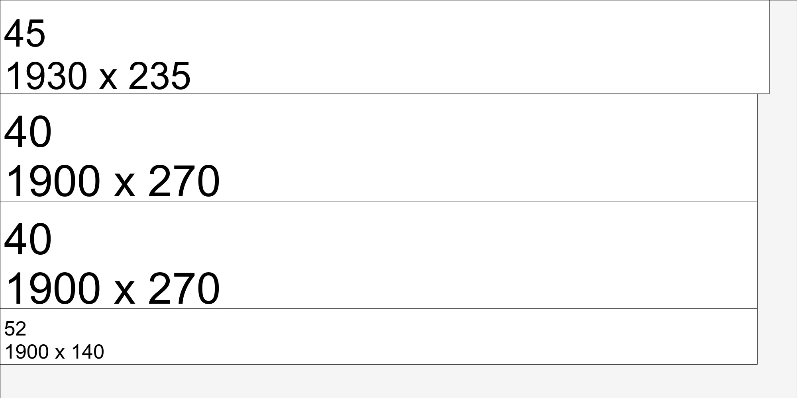

# bin-packer
I made it for a metal cutting company. This code selects the appropriate raw metal sheets for cutting.
Original idea Padam87 link: https://github.com/Padam87/bin-packer 
2D bin packing for PHP, with rotation.

## Usage
### Basic

```php

$Boxes = [
    new Block(100, 100),
    new Block(300, 100),
];
$bin = new Bin(1500,3000);    
$bin->insertManyBlock($Boxes);


```

#### How to get unused Boxes
You will get all unused Block as a array.

```php
$unusedBoxes = $bestBin->getUnpackedBlocks()

```
### How to get used boxes
You can get the node tree and evaluate it with a function

```php

    $node = $bin->getNode();
    getUsedBlock($node);

    function getUsedBlock(\Node $node)
    {
        if($node == null)
            return;
        if($node->isUsed())
        {
            print_r($node->getBlock());
            $this->getUsedBlock($node->getRight());
            $this->getUsedBlock($node->getDown());
        }
    }

```

### How to get score 

```php
    $sc = $bestBin->getStatistic();


Array
(
    [score] => 0.72624 // [used] / ([binWidth]*[binHeight])
    [used] => 2269500  // used arrea 
    [free] => 855500   // free arrea
    [binWidth] => 2500 
    [binHeight] => 1250
)

```

### Visualiser 

```php
        $visualizer = new Visualizer();
        $image = $visualizer->visualize($bin);
        $image->setFormat('jpg');
        $image->writeImage('bin.jpg');
```



